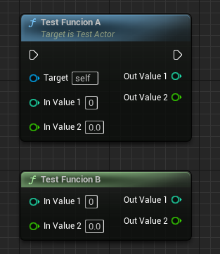
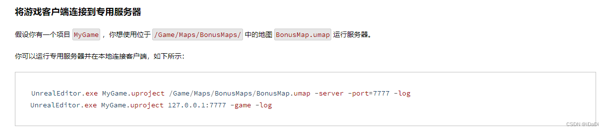
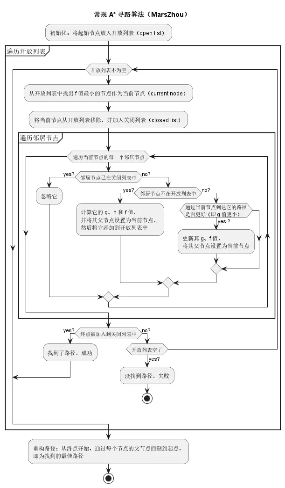
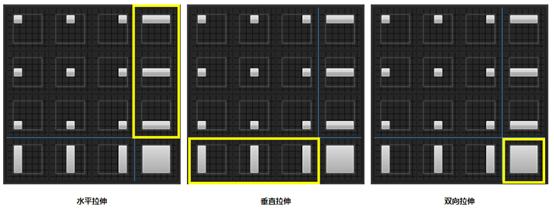

https://www.jianshu.com/p/6461afc2cfc7

# 1. Actor的EndPlay事件在哪些时候会调用？
 - 对Destory显示调用
 - actor的生命周期已过
 - 关卡过渡(无缝加载和加载地图)包括Actor的关卡被卸载
 - 应用程序关闭
 - play in editor终结
# 2. BlueprintImplementableEvent和BlueprintNativeEvent之间有什么区别？
- BlueprintImplementableEvent是在C++中声明的函数，然后在蓝图中来实现该函数
```cpp
UCLASS()
class YOURPROJECT_API AYourClass : public AActor
{
    GENERATED_BODY()

public:
    UFUNCTION(BlueprintImplementableEvent, Category = "YourCategory")
    void YourEvent();
};
```
- BlueprintNativeEvent是在C++中声明并定义提过一个默认实现后，可以在蓝图中覆盖掉该实现，类似于虚函数override
```cpp
UCLASS()
class YOURPROJECT_API AYourClass : public AActor
{
    GENERATED_BODY()

public:
    UFUNCTION(BlueprintNativeEvent, Category = "YourCategory")
    void YourEvent();
    virtual void YourEvent_Implementation();
};
```
# 3. BlueprintCallable和BlurprintPure在什么时候使用？
BlueprintImplementableEvent和BlueprintNativeEvent是在C++中调用蓝图的实现，而BlueprintCallable和BlurprintPure是在蓝图中调用C++的实现
```cpp
//---- .h ----
// 普通函数
UFUNCTION(BlueprintCallable)
void TestFuncionA(int InValue1, float InValue2, int& OutValue1, float& OutValue2);
// 纯函数
UFUNCTION(BlueprintPure)
void TestFuncionB(int InValue1, float InValue2, int& OutValue1, float& OutValue2);

//---- .cpp ----
void ATestActor::TestFuncionA(int InValue1, float InValue2, int& OutValue1, float& OutValue2)
{
}
void ATestActor::TestFuncionB(int InValue1, float InValue2, int& OutValue1, float& OutValue2)
{	
}

```
  
BlueprintCallable和BlueprintPure的区别是，如果函数的UFUNCTION中用了BlueprintPure标记则表示这是个纯函数，在蓝图这边不能看到target引脚。如果换成BlueprintCallable则表示是个普通的函数  

# 4. UE4的蓝图中对于Foreach等循环采用的是类似并行的方式，试实现一个串行的方法。

# 5. 如何解决子弹穿墙问题？
使用射线MultiLineTraceByChannel，这个射线可以穿透多个物体(返回一个数组表示所有被射中的物体)。而LineTraceByChannel只要击中一个物体就会停止。

# 6. UE4对UStruct的内存会自动管理吗？
USTRUCT宏修饰的结构体会在UHT中生成UScriptStruct(通过xxx::StaticStruct获得)，USTRUCT修饰的结构体，是不能包括UFUNCTION的(可以包含普通函数, C++的基本功能)，否则会报错USTRUCT's Cannot contain UFUNCTION，UE想把USTRUCT单纯当成一个数据，而不是类似C++中的struct和class职责划分不明确。
USTRUCT修饰的struct拥有和UObject一样的反射、序列化、网络复制，但不受GC管理。而UStruct是UScriptStruct的基类，同样不支持GC。而UClass继承于UStruct，但是在UHT的时候，会通过DECLARE_CLASS宏，将里面的属性AddReferencedObjects。    
如果想要普通的struct/class被GC管理必须继承自FGCObject对象，并实现派生的AddReferencedObjects接口，手动将UObject* 变量加入到引用。Object对象采用垃圾回收机制，被UPROPERTY宏修饰或在AddReferencedObjects函数被手动添加引用的UObject*成员变量，才能被GC识别和追踪，GC通过这个机制，建立起引用链（Reference Chain）网络。

没有被UPROPERTY宏修饰或在AddReferencedObjects函数被没添加引用的UObject*成员变量无法被虚幻引擎识别，这些对象不会进入引用链网络，不会影响GC系统工作（如：自动清空为nullptr或阻止垃圾回收）。

垃圾回收器定时或某些阶段（如：LoadMap、内存较低等）从根节点Root对象开始搜索，从而追踪所有被引用的对象。

当UObject对象没有直接或间接被根节点Root对象引用或被设置为PendingKill状态，就被GC标记成垃圾，并最终被GC回收。

注1：USTRUCT宏修饰的结构体对象和普通的C++对象一样，是不被GC管理
注2：FGCObject对象和普通的C++对象一样，是不被GC管理

# 7. 在客户端是否可以获取到AIController？
不可以,在DS(dedicated server)模型下,AIController只存在于服务端,其主要是通过在服务端对Pawn进行操控, 然后再同步到客户端。

# 8. 客户端上面能够执行RPC的对象有哪些？
RPC（远程过程调用），是在本地调用但能在其他机器（不同于执行调用的机器）上远程执行的函数。
在客户端上能够执行RPC的对象需要满足：
- 该Actor必须被复制
- 如果RPC是从客户端调用并在服务器上执行，客户端就必须拥有调用RPC的Actor。
- 如果是多播RPC是个例外：
当从客户端调用时，只是在本地运行而非服务器上执行。

# 9. 如果在C++中需要使用windows的头文件，如何操作？
```cpp
#include "AllowWindowsPlatformTypes.h"
#include <windows.h>
#include "HideWindowsPlatformTypes.h"
```
# 10. 在头文件中经常出现的*.generated.h是什么？
表明这个class被UCLASS宏标记，或者struct被USTRUCT标记，UHT会扫描该头文件，将该类加入到反射系统，记录下来UPROPERTY和UFUNCTION的偏移量，该类才能使用到UE反射系统的GC，序列化，网络同步等功能。


# 11. 对一个Actor调用AIMoveTo失败了，其可能原因是什么？
- 检查有没有添加导航体网格
- 检查场景中的碰撞是否把AI阻挡了
- 要移动的pawn和目标点或者目标actor没有正确设置
- 检查AIController是否为空
- 如果AI是生成的而不是一开始就放到场景的(把AutoPossessAI设置为PlacedInWorldOrSpawned)  
[AIMoveTo失败原因](https://blog.csdn.net/qq_41410054/article/details/130870008)

# 12. 试说出宏、函数、事件的部分区别和联系。
事件是触发，事件里面的定时不会等待完成就会接着继续执行后面的逻辑
函数和宏都会等待定时完成后才能继续执行。宏和函数都可以有返回值，而事件不能有返回值。
宏不能在其他蓝图里面调用，函数事件则可以。

# 13. 试使用C++实现一个对蓝图中任意Actor排序的框架。

# 14. Blueprintable和BlueprintType的意义。
Blueprintable:将使用该宏标志的类公开为创建蓝图的可接受基类（类似于：那些base类）。
其默认为NotBlueprintable,即不可以创建蓝图子类。

BlueprintType:将使用该宏标志的类公开为可用于蓝图中变量的类型（类似于：int）。
与之对应的有NotBlueprintType，即不可以在蓝图中创建该类型的变量。

# 15. 客户端上面对一个Actor中的RPC事件调用失败，可能原因是什么？
- 该Actor不可被复制
- 其他的客户端上，未拥有可以调用RPC的Actor。
- 在Pawn派生类的蓝图收到Possessed事件时，Connection->ViewsTarget还未被赋值。  
[rpc调用不起作用](https://blog.csdn.net/xiaozhi0999/article/details/51489901)
# 16. UE4中的RPC事件有哪些？
RPC主要包括Multicast（广播）、Run On Server（在服务端执行）和Run On Owning Client（在客户端执行）三种类型。其中广播类型在服务器上调用执行，然后自动转发给客户端；在服务端执行的函数有客户端调用，然后仅在服务器执行。在客户端执行的函数由服务器调用，然后仅在自己的客户端上执行。
# 17. 如何设置Actor的同步间隔？
Actor的同步分为属性同步和RPC，属性同步会在属性变化时就会同步，而RPC只有在调用的时候才会同步。RPC的实时性比属性同步要好，RPC调用瞬间能发送远端执行，而属性同步还需要等待packet包满了之后才能发送网络请求。可以尝试修改Actor中属性NetUpdateFrequency字段以及MinNetUpdateFrequency字段，来修改同步频率。  
[属性复制](https://docs.unrealengine.com/4.27/en-US/InteractiveExperiences/Networking/Actors/Properties/)

# 18. 若需要实现一个多播事件，如何操作？

# 19. 连接服务器的命令是什么，如何传递参数？

如果是源代码连接服务器则
```cpp
Socket->Connect(*addr);
```
控制台命令
```
open 127.0.0.1
```
# 20. 为什么需要TWeakPtr？
类似于C++ std::weak_ptr, 防止循环引用。使用时，Get一下判断引用的对象是否还存在。

# 21. 如果要在游戏的开始和结束执行某些操作，可以在UE4哪儿处理？
- 关卡开始结束, 可以放到Actor的BeginPlay和EndPlay()
- GameInstance Init()和Shutdown()
- UEngine Init()和PreExit()
# 22. UE4中，各种字符编码如何转换？
```cpp
    TCHAR_TO_ANSI(str)
    TCHAR_TO_OEM(str)
    ANSI_TO_TCHAR(str)
    TCHAR_TO_UTF8(str)//TCHAR转UTF8
    UTF8_TO_TCHAR(str) 
```

# 23. C++源文件中的注释在蓝图中显示为乱码，为什么？
需要将C++源文件的文件编码格式改为UTF-8格式。
# 24. 插件中的LoadingPhase是什么？
LoadingPhase主要用于控制插件在引擎启动的何时被加载。
```cpp
/**
 * Phase at which this module should be loaded during startup.
 */
namespace ELoadingPhase
{
	enum Type
	{
		/** As soon as possible - in other words, uplugin files are loadable from a pak file (as well as right after PlatformFile is set up in case pak files aren't used) Used for plugins needed to read files (compression formats, etc) */
		EarliestPossible,

		/** Loaded before the engine is fully initialized, immediately after the config system has been initialized.  Necessary only for very low-level hooks */
		PostConfigInit,

		/** The first screen to be rendered after system splash screen */
		PostSplashScreen,

		/** Loaded before coreUObject for setting up manual loading screens, used for our chunk patching system */
		PreEarlyLoadingScreen,

		/** Loaded before the engine is fully initialized for modules that need to hook into the loading screen before it triggers */
		PreLoadingScreen,

		/** Right before the default phase */
		PreDefault,

		/** Loaded at the default loading point during startup (during engine init, after game modules are loaded.) */
		Default,

		/** Right after the default phase */
		PostDefault,

		/** After the engine has been initialized */
		PostEngineInit,

		/** Do not automatically load this module */
		None,

		// NOTE: If you add a new value, make sure to update the ToString() method below!
		Max
	};
}
```
# 25. 如何切换不同的引擎版本？
选中项目.uproject文件->鼠标右键->Switch Unreal Engine Version
# 26. 对于一个团队项目，如何处理DDC？
DDC为派生数据缓存。
如果是同一地点的团队或者是小团队，可以设置共享DDC。此为所有团队成员和构建计算机均可读取/写入的网络驱动器。如果是大型项目，并希望分发预构建DDC数据，则应该生成DDC pak。
# 27. UFUNCTION，UPROPERTY等宏的作用是什么？

# 28. 如何给AI增加playerstate？
默认情况下，只有玩家才有playerState, 如果想让AI也有PlayerState, 修改AIController下的bWantsPlayerState属性为true，就能让AIController使用playerState了

# 29. ProjectileComponent是否同步？若未同步，如何操作？
如果ProjectileComponent是指的UProjectileMovementComponent，则不是同步的，虽然说ProjectileComponent是继承自UActorComponent，具备了同步的能力，但是他没有开启SetIsReplicated(true)
想要component开启网络同步的能力
- Component必须以Actor的方式来实施::GetLifetimeReplicatedProps函数
- 在Component里面设置AActorComponent::SetIsReplicated(true)
或者在ProjectileComponent执行一个操作后通过RPC来同步操作的结果。
# 30. 若要更改某个Actor中的组件为其派生的组件，如何操作？
在一开始将该父类组件申明为指针，当要更改时，直接指向其派生的组件对象即可。
# 31. UE4的游戏框架包含哪些内容？
- Pawn 兵卒，设计给玩家操作的对象抽象，Pawn由Controller拥有，可以接受输入，pawn不被认定为具有人的特性
- Character Character是带有人形风格的Pawn，Character继承于Pawn，默认情况下，带有一个拥有碰撞的CapsuleComponent和一个用于移动的CharacterMovementComponent组件
- Controller 控制Pawn的行为，继承自AActor，Controller有两种，一种是PlayerController，一种是AIController，PlayerController用来控制Pawn，需要玩家手动来控制。而AIController控制Pawn时，是计算机用来控制NPC的行为。
- GameMode 继承于AInfo，承担了游戏玩法的职责，包括游戏的开始结束，游戏内实体的Spawn(包括Pawn，PlayerController,AIController也是由GameMode负责Spawn)，关卡切换，只存在于服务器，然后Replicated到所有客户端
- GameState 继承于AInfo，用来保存当前游戏的状态数据，其中可以包括联网玩家列表、得分、棋类游戏中棋子的位置，或者开放时间场景中完成任务的列表等。存在于服务端，然后也可以Replicated到多个客户端。
- PlayerState 继承于AInfo，用来保存玩家的数据，比如玩家姓名、得分、MOBA等比赛中等级，PlayerState存在客户端，所有玩家的PlayerState存在于所有的机器上，并且可以Replicated以保存同步
# 32. 当前UE4在移动平台上面的问题有哪些？

# 33. 如何获取UE4的源码？
- 登录Unreal Engine获取github授权，加入EpicGames组织
- git clone https://github.com/EpicGames/UnrealEngine
# 34. UE4服务器的默认监听端口是哪一个？采用的是UDP还是TCP协议？
默认监听端口7777，采用的UDP协议
# 35. Tick中的帧时间是否可靠？若不可靠，如何操作？
不可靠，因为游戏运行过程中，帧率并不是稳定的，而tick的帧时间表示的是距离上一帧过去了多久。可以用每秒需要的变化量，乘以deltaTime来平衡掉帧的影响。  
例如,需求每秒钟移动30m，如果帧数稳定为100，则每帧应该加30/100 = 0.3m, 但是实际帧率不稳定，若1s内在0.2s, 0.5s, 0.96s 1s调用了此方法，即，这1s点平均帧数为4fps, 那么每次调用前进的距离应该为0.2 * 30 + 0.3 * 30 + 0.46 * 30 + 0.04 * 30 = 30。则每帧移动deltaTime * 30
# 36. UE4的打包方法有哪些？
- UE编辑器打包
- RunUAT打包 RunUAT是UE4提供的一个命令行工具，用于自动化打包过程。用户可以通过编写批处理脚本（.bat文件）来调用RunUAT，并指定一系列参数来控制打包的过程。这些参数包括项目路径、平台、配置模式（开发、发行等）、是否烘焙地图、输出目录等。通过RunUAT，用户可以实现更灵活的打包配置，适用于不同的需求和场景。
# 37. 如何制作差异包或者补丁？

# 38. 试说出Selector、Sequence、Parallel的运作流程。

# 39. UE4中的AI感知组件有哪些？
- 伤害的感知 AI Damage sense config
- 听觉的感知 AI Hearing config
- 预测的感知 AI Prediction sense config
- 视觉的感知 AI sight config
- 团队的感知 AI Team sense config
- 触觉的感知 AI Touch config

# 40. 在UE4的C++中调用父类的函数，如何操作？
```cpp
Super::BeginPlay()
```
# 41. UE4内置的伤害接口是什么，有哪些类型？
```cpp
    // GameplayStatic.h
    UFUNCTION(BlueprintCallable, BlueprintAuthorityOnly, Category="Game|Damage")
    static float ApplyDamage(AActor* DamagedActor, float BaseDamage, AController* EventInstigator, AActor* DamageCauser, TSubclassOf<class UDamageType> DamageTypeClass);  
    //->{
    //      ...
    //      DamagedActor->TakeDamage()
    //      ...
    //  };
    // Actor.h
    virtual float TakeDamage(float DamageAmount, struct FDamageEvent const& DamageEvent, class AController* EventInstigator, AActor* DamageCauser);
    // DamageEvents.h
    USTRUCT()
    struct ENGINE_API FPointDamageEvent : public FDamageEvent{...}
    USTRUCT()
    struct ENGINE_API FRadialDamageEvent : public FDamageEvent
```
- struct FPointDamageEvent  /**Damage subclass that handles damage with a single impact location and source direction */
- struct FRadialDamageEvent /** Damage subclass that handles damage with a source location and falloff radius */
# 42. UE4的蓝图部分在版本控制软件中无法进行比较，你是否有好的解决方案？
写代码吧，业务逻辑用lua
# 43. UE4中的联网会话节点有哪些？

# 44. UE4中的字符串有哪些？
- FName 资源名字字符串
- FText 显示字符串
- FString 可以被操作的字符串，开销大于上面两种

# 45. 获取和释放角色如何操作？
获取
- 方法1, 在editor中把character拖到场景中，右侧的auto possess player选择player0
- 方法2, 查看wordSetting设置好的GameMode，设置里面的Default Pawn class为我们想要控制的角色，然后在场景中放置一个playerStart出生位置就可以了。
- 方法3, 代码中获取到Character，调用PossessedBy传入Controller即可。
- 方法4，代码中获取到Controller，调用Possess传人Character即可
释放:
- 方法1，代码中对Character调用UnPossess
- 方法2，代码中对Controller调用UnPossess
# 46. 设置地图的游戏模式，有哪些方法？
- 编辑器中选择左上角edit->ProjectSettings->Map&Modes->Default GameMode
- 编辑器中选择左上角windoww->worldSettings->GameMode Override选择我们想要的GameMode
# 47. 玩家操作事件放在PlayerController和Pawn中，该如何选择？
放在Controller中：
- 从概念上：如果是一些Pawn本身固有的能力逻辑，如前进后退、播放动画、碰撞检测之类的就完全可以在Pawn内实现；而对于一些可替换的逻辑，或者智能决策的，就应该归Controller管辖。
- 从对应上: 如果一个逻辑只属于某一类Pawn，那么其实你放进Pawn内也挺好。而如果一个逻辑可以应用于多个Pawn，那么放进Controller就可以组合应用了。
- 从存在性上：Controller的生命期比Pawn要长一些，比如我们经常会实现的游戏中玩家死亡后复活的功能。对于那些需要在Pawn之外还要持续存在的逻辑和状态，放进Controller中是更好的选择。
# 48. 切换关卡的命令是什么？
openLevel levelName
# 49. UE4中是否可以支持回放？如何操作？
支持，利用网络同步的思想，把游戏本身当成一个服务器，游戏内容当成同步数据进行录制存储即可。
# 50. UE4的蓝图类型有哪些？
- 关卡蓝图
- 普通蓝图
- 游戏模式蓝图
- 材质蓝图
- Actor蓝图
- Component蓝图
- Widget蓝图
- 动画蓝图
...
# 51. 添加一个USTRUCT MyStruct，是否可以？

# 52. 若要C++中的属性暴露给蓝图，如何操作？
加上UPROPERTY即可。
提问，纯C++的stcut/class属性可以吗，没有反射的原生类型?
# 53. 在C++中为对象设置默认值有哪些方法？

# 54. C++中Reliable的意义是什么，该如何实现对应的操作？
表示该RPC是可靠的RPC， UE会用UDP模仿TCP，来保证RPC严格按序达到远端，适用于对GamePlay很关键但不经常调用的函数，包括碰撞事件，武器发射的开始或者结束，或生成Actor。
# 55. 如果项目中需要专用服务器，如何操作？
- 通过源码编译好Development Server
- 打包客户端成exe
- 启动好server，然后用client去连接server
[使用Dedicated Server](https://zhuanlan.zhihu.com/p/46415816)
# 56. UE4中的Delegates有哪些？
- 单播
- 多播
- 动态单播
- 动态多播
- 事件
# 57. 如何分析性能瓶颈在哪儿？
- stat
- unreal fornted profiler
- unreal insights
# 58. UE4的碰撞类型有哪些？
- No Collision
- Query Only
- Phsics Only
- Collision Enable(Query and Physics)
```cpp
	/**
	* Type of collision enabled.
	* 
	*	No Collision      : Will not create any representation in the physics engine. Cannot be used for spatial queries (raycasts, sweeps, overlaps) or simulation (rigid body, constraints). Best performance possible (especially for moving objects)
	*	Query Only        : Only used for spatial queries (raycasts, sweeps, and overlaps). Cannot be used for simulation (rigid body, constraints). Useful for character movement and things that do not need physical simulation. Performance gains by keeping data out of simulation tree.
	*	Physics Only      : Only used only for physics simulation (rigid body, constraints). Cannot be used for spatial queries (raycasts, sweeps, overlaps). Useful for jiggly bits on characters that do not need per bone detection. Performance gains by keeping data out of query tree
	*	Collision Enabled : Can be used for both spatial queries (raycasts, sweeps, overlaps) and simulation (rigid body, constraints).
	*/
    	UPROPERTY(EditAnywhere, Category=Custom)
	TEnumAsByte<ECollisionEnabled::Type> CollisionEnabled;
```
| 属性 | 说明 |
| ---- | ---- | 
|无碰撞（No Collision）| 在物理引擎中此形体将不具有任何表示。不可用于空间查询（光线投射、Sweep、重叠）或模拟（刚体、约束）。此设置可提供最佳性能，尤其是对于移动对象。|
|仅查询（Query Only）| 此形体仅可用于空间查询（光线投射、Sweep和重叠）。不可用于模拟（刚体、约束）。对于角色运动和不需要物理模拟的对象，此设置非常有用。通过缩小物理模拟树中的数据来实现一些性能提升。|
|仅物理（Physics Only）| 此形体仅可用于物理模拟（刚体、约束）。不可用于空间查询（光线投射、Sweep、重叠）。对于角色上不需要按骨骼进行检测的模拟次级运动，此设置非常有用。通过缩小查询树中的数据来实现一些性能提升。|
|启用碰撞（Collision Enabled）| 此形体可用于空间查询（光线投射、Sweep、重叠）和模拟（刚体、约束）。|

# 59. UE4的服务器是否适应于MMO？若不适应，有什么解决方案？
不适应，至少我们项目的服务器是自己搞的一套，甚至都没用上UE的这套rpc
# 60. 动画蓝图是否支持同步？若不支持，有什么解决方案？

# 61. 材质参数、特效参数、声音参数如何使用？

# 62. 若要对打包之后的版本进行跟踪和调试，如何操作？

# 63. C++中如何对组件或者Actor设置同步？

# 64. UE4的AA算法有哪些？
- MSAA
- TAA
- FXAA

# 65. 四元数相对于欧拉角的优点。
- 欧拉角有万向死锁问题
- 不能对欧拉角进行插值
# 66. 简述A*算法。
f(n) = g(n) + h(n)
g(n)是从起始点到当前点的代价，也就是起点到当前点的距离，h(n)是从当前点到目的点的预估代价，一般是曼哈顿距离(x，y轴距离之和)
流程:
- 创建两个空表，open表和close表，并将起始点放入open表，并更新里面所有点的f(n)值
- 从open表里面选择f(n)值最小的节点A取出，判断A是否是目标点，如果是则算法结束。
- 如果A不是目标点，将A点放入close表，并将这个点紧邻的点放入到open表中(不在close中的点)，然后更新open表中所有点的f(n)值。重复上面步骤。  


# 67. UE4中需要对一个原本不支持寻路的Actor实现寻路功能，如何实现？

# 68. UI中的锚是用来干什么的？
锚（Anchor）用来定义 UI 控件在 画布面板 上的预期位置，并在不同的屏幕尺寸下维持这一位置 。锚也可以理解为就是用来设置布局方式的，随着屏幕尺寸的改变，定义这个UI相对于父节点怎么停靠以及是否拉伸。

# 69. 如何基于UE4的网络接口，实现一个网络层，如Steam？

# 70. 对于打包之后的游戏资源，有什么加密方案？
- 打包流程中可以配置pak加密
- 打完包之后，
# 71. 在Actor中增加了输入事件，但是输入事件却无法触发，其原因可能有哪些？
- Actor没有启用输入EnableInput
# 72. SpawnActor的位置不对，为什么？
- 可能目标位置被其他actor占用
# 73. 在BeginPlay之后调用了某个RPC操作，客户端却没有执行到，可能原因是什么？

# 74. 在客户端没有连接到服务器之前，有什么同服务器进行通信的方案吗？

# 75. 如何在Actor中增加command命令？

# 76. 命令行中ce和ke有什么作用？

# 77. UE4中的智能指针有哪些？

# 78. 试描述你之前做过的项目中的部分功能。（没啥好说的，各个项目需求千差万别，主要目的是看有没有具体做过）

# 79. 对根组件设置Scale会有问题吗？

# 80. 如何在UE4中使用静态库或者动态库？

# 81. 试分析GameMode的运行流程，如从InitGame至Logout。（very hard， especially without source code）

# 82. UE4的自动化测试如何搞？

# 83. 多个摄像机之间如何切换？

# 84. 更新UI的方式有哪些？

# 85. 如何区分并调节不同的音效？

# 86. 如何销毁AIController？

# 87. 在C++和蓝图中如何打印调试信息？

# 88. 轴输入事件在值为0的时候会触发吗？

# 89. 3DWidget如何使用？

# 90. 游戏中的AI技术有哪些？

# 91. 导航网格和寻路组件各有什么作用？

# 92. 对于编译整个引擎耗费的大量时间，有什么解决方案？

# 93. 如何联机构建光照？

# 94. Montage是什么？

# 95. 执行动画时，将动画和声音、特效匹配的较好的方案是什么？

# 96. 如何获取动画的执行事件？

# 97. Service的执行时机是什么时候？

# 98. Observer Aborts的用途是什么？

# 99. 如何更改UE4默认的同步带宽？

# 100. UE4中的数据存取方法有哪些？


# Recast Navigation工作原理
## 一. recast
- 体素化得到span: 用三角形的AABB包围盒在xz平面度投影
- 过滤可行走表面，三角形法向量小于某个值可以行走，该三角形体素化后的span上方高度差小于walkableClimb的span也标记为可行走，如楼梯台阶，路沿。
- 划分可行走表面为简单区域
- 生成轮廓
- 生成多边形网格
- 生成细节网格

## 二. detour

# UE 动画更新逻辑

# UE和slua的交互原理
